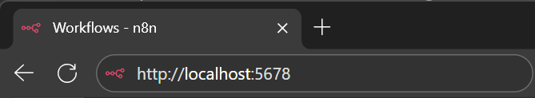
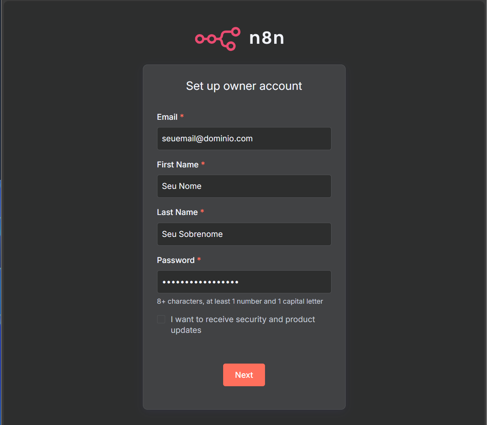
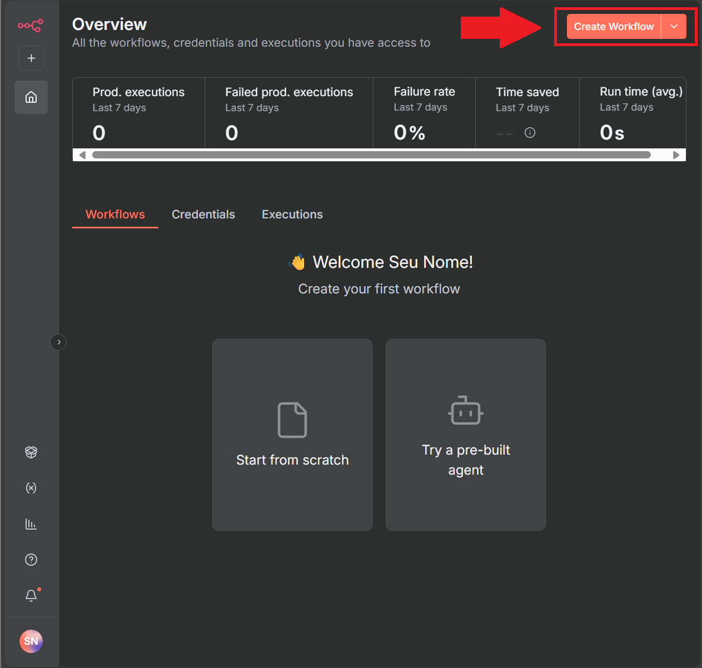
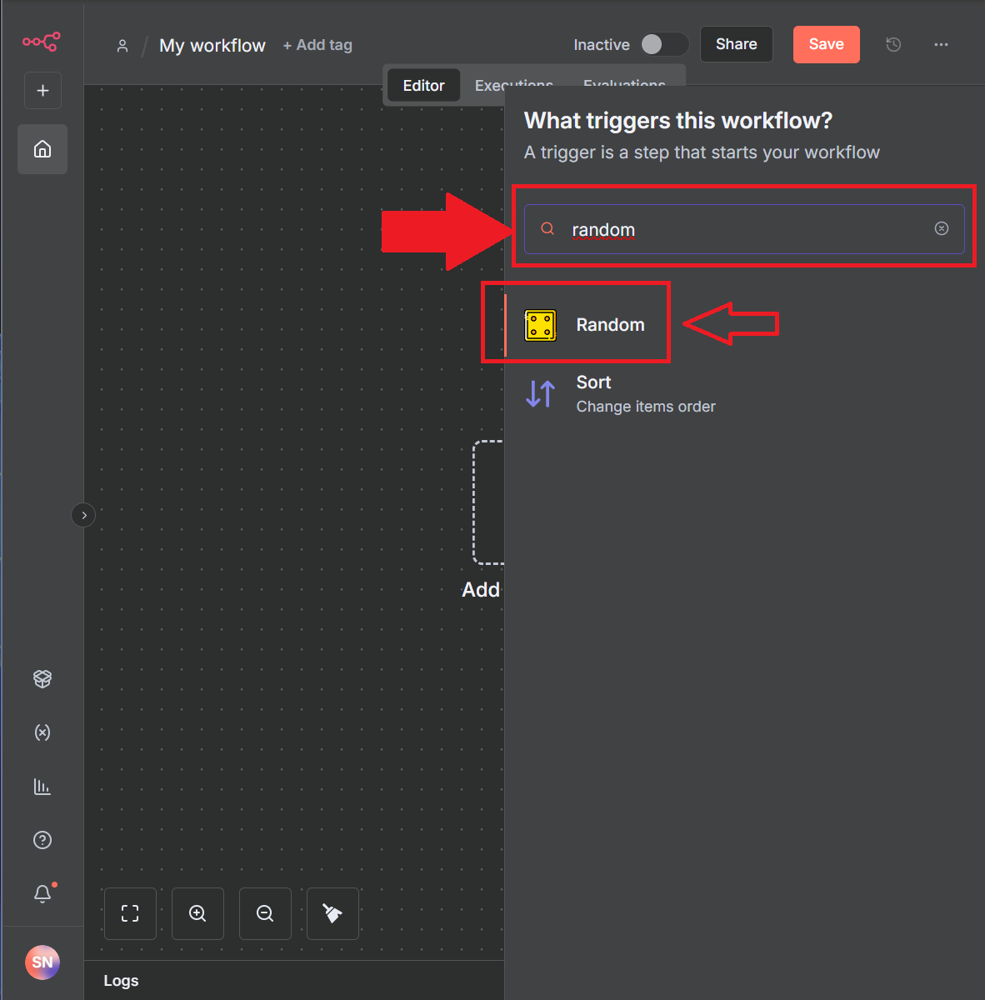
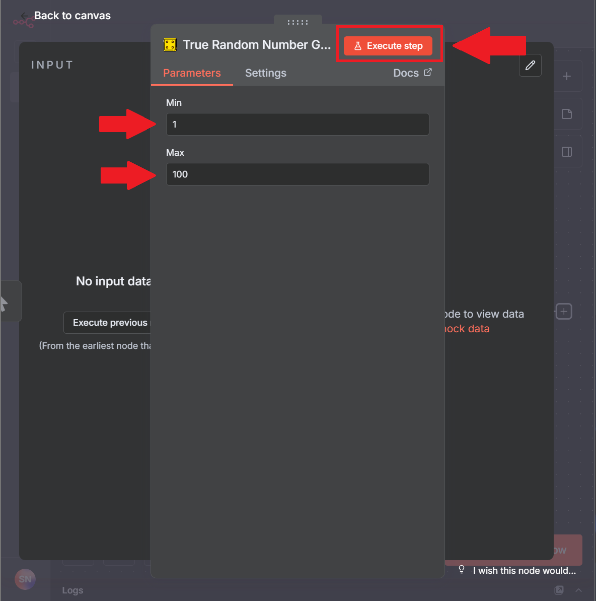
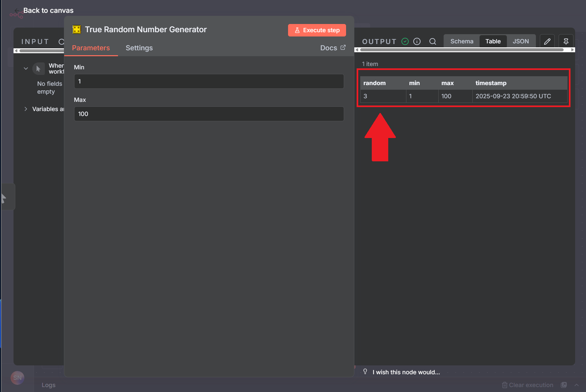

# 🎲 n8n Custom Node: Random Number Generator

Custom node para n8n que gera números aleatórios através da API Random.org, desenvolvido como parte do processo seletivo da Onfly.

[Detalhes do desafio](docs/Desafio.md)

## 📋 Sobre o Projeto

O conector **Random** possui uma única operação "True Random Number Generator" que:
- Recebe parâmetros de entrada: **Min** e **Max** (números inteiros)
- Utiliza a API Random.org para gerar números verdadeiramente aleatórios
- Retorna o número gerado com metadados (timestamp, min, max)

### 💻 Tecnologias Utilizadas
- **Node.js 22**
- **TypeScript**
- **n8n**
- **Docker**
- **PostgreSQL**
- **Random.org API**

### 📦 Estrutura do Projeto

```
├── nodes/
│   └── Random/
│       ├── Random.node.ts      # Implementação do nó n8n
│       ├── Random.node.json    # Metadados do nó
│       ├── RandomService.ts    # Serviço para API Random.org
│       └── random.svg          # Ícone do nó
├── docker-compose.yml          # Configuração dos serviços
├── Dockerfile                  # Build do custom node
├── package.json               # Dependências e scripts
├── tsconfig.json             # Configuração TypeScript
├── gulpfile.js               # Build dos ícones
└── init-data.sh             # Inicialização do banco
```

## ⚙️ Instalação e Configuração

### 1. Instale o Node.js 22 (LTS)
**Baixe e instale em: https://nodejs.org/**
```bash
# Verifique a instalação:
node --version  # deve mostrar v22.x.x
npm --version
```

### 2. Instale o Docker e Docker Compose
**Baixe e instale em: https://www.docker.com/get-started**
```bash
# Verifique a instalação:
docker --version
docker-compose --version
```

### 3. Instale o Git
**Baixe e instale em: https://git-scm.com/**
```bash
# Verifique a instalação:
git --version
```

### 4. Clone o Repositório
```bash
git clone https://github.com/luizfelipelinhares/n8n-node-random-number-generator.git
cd n8n-node-random-number-generator
```

### 5. Configure as Variáveis de Ambiente
Crie um arquivo `.env` na raiz do projeto:
```bash
# Configurações do PostgreSQL
POSTGRES_USER=ChangeSuperUser
POSTGRES_PASSWORD=ChangeSuperUserPassword
POSTGRES_DB=n8n_db
POSTGRES_NON_ROOT_USER=ChangeUser
POSTGRES_NON_ROOT_PASSWORD=ChangeUserPassword
```

### 6. Execute o Projeto
```bash
docker-compose up --build -d
```

## 🎯 Como Usar o Custom Node

### 1 - Acesse o n8n: em http://localhost:5678


### 2 - Configure sua conta no primeiro acesso


### 3 - Crie um novo workflow


### 4 - Adicione o node "Random" (procure por "Random" na paleta de nós)


### 5 - Configure os parâmetros e execute
   - **Min**: Valor mínimo (ex: 1)
   - **Max**: Valor máximo (ex: 100)
   #### *Valores permitidos: entre -1000000000 e 1000000000*


### 6 - Veja os resultados


#### Exemplo de Saída
```json
{
  "random": 42,
  "min": 1,
  "max": 100,
  "timestamp": "2025-09-23 19:17:11 UTC"
}
```

## 📚 Recursos Utilizados
- [n8n - Build a programmatic-style node](https://docs.n8n.io/integrations/creating-nodes/build/programmatic-style-node/)
- [n8n - Docker installation](https://docs.n8n.io/hosting/installation/docker/)
- [n8n - Run nodes locally](https://docs.n8n.io/integrations/creating-nodes/test/run-node-locally/)
- [n8n - Hosting with PostgreSQL](https://docs.n8n.io/hosting/installation/docker/#using-with-postgresql)
- [n8n - Docs AI](https://docs.n8n.io/)
- [API Random.org](https://www.random.org/clients/http/)