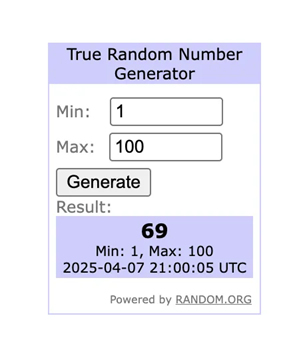

# OnFly - Desafio custom node n8n

Como desenvolvedor você deve criar um conector personalizado para a plataforma de automação n8n. Um conector personalizado permite estender a capacidade da poderosa ferramenta de workflows low-code, possibilitando uma experiência mais simplificada para seus usuários.

## O que iremos construir
Um conector do n8n que recebe um input de mínimo e máximo inteiro (ambos inclusos) para retornar um número aleatório!

## Pré requisitos técnicos

- Node.js + TypeScript na versão 22 (LTS)
- Docker compose para subir o n8n + instância Postgres para o n8n

## Requisitos funcionais do conector personalizado

- O conector deve se chamar Random e possuir uma única operação: “True Random Number Generator”
- A operação de gerar o número randômico deve possuir dois inputs: “Min” e “Max”, ambos devem aceitar [apenas números](https://docs.n8n.io/integrations/creating-nodes/build/reference/ui-elements/#number).
- O “execute” do conector deve utilizar, obrigatoriamente, a API do Random.org para gerar números randômicos, mais especificamente este endpoint GET: https://www.random.org/integers/?num=1&min=1&max=60&col=1&base=10&format=plain&rnd=new

## Requisitos não funcionais

- Utilize nomes amigáveis aos parâmetros criados nas descriptions
- Adicione um icone SVG para o Node

## Critérios de avaliação

- Configuração da infra do n8n local, considerando a utilização de Docker compose e banco PostgreSQL
- Configuração correta da pasta interna de conectores personalizados (.n8n/custom)
- Organização de arquivos do conector personalizado
- Qualidade e limpeza do código para implementar o custom node
- Qualidade da integração com o Random.org
- Qualidade e atenção aos detalhes na criação do conector
- Qualidade e detalhamento do README para instalar e rodar o repositório contendo o Docker compose da aplicação, bem como o pacote npm do node
- Utilização das melhores práticas, conforme documentação oficial do n8n

## Como entregar

- Suba o projeto em um repositório p**úblico** no GitHub e compartilhe o acesso com nosso time.
- No repositório, inclua um **README.md** com as instruções para:
    - Instalar as dependências.
    - Executar o serviço localmente (usando Docker).
    - Configurar o ambiente (variáveis de ambiente, banco de dados, etc.).
    - Executar os testes.
    - Qualquer informação adicional que você considere relevante.

## Passo a passo para subir a infra do n8n e testar conectores customizados

- [n8n instalado com Docker na versão self-hosted local na versão estável mais recente (@latest = 1.85.4)](https://docs.n8n.io/hosting/installation/docker/)
- [Seguir a linha de desenvolvimento programática de um custom node](https://docs.n8n.io/integrations/creating-nodes/build/programmatic-style-node/)
- [Instalar e rodar o custom node localmente](https://docs.n8n.io/integrations/creating-nodes/test/run-node-locally/)

[Resolução do desafio](../README.md)